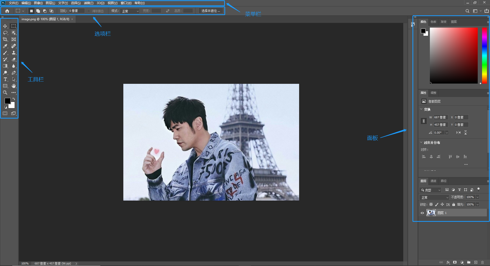

#  一、安装

## 1. 官方下载

**①. 点击下方链接安装 Adobe 桌面应用程序**

[安装 Creative Cloud >> ](https://creativecloud.adobe.com/apps/download/creative-cloud?locale=zh-cn)

**②. 首页找到PS软件进行安装**

> 官方安装只能使用，如果你有账号推荐使用官方下载方式。

## 2. 破解版本

这个直接找度娘吧，百度搜索 ‘PS破解版’，找一个可信度高一点的来下载。

# 二、认识桌面

# 三、常用分辨率设置

- 洗印照片，300或以上
- 杂志、名片等印刷物 300
- 海报高清写真 96~200
- 网络图片、网页界面 72
- 大型喷绘 25-50

# 四、前期准备工作

## 1. 暂存盘

通过快捷键 `Ctr + K` 进入**首选项**，选择 **性能**,  找到 **暂存盘**，将其 从 C 盘勾选到其他盘。

> 如果你没有找到 暂存盘，可以选择性能面板上的 “下一个” 切换。

## 2. 历史记录

同样在 **性能面板** 中找到 **历史记录状态**，默认值为 **50**，我们可以将其设置成 **200**，这样就可以记录 200 次操作步骤啦。

## 3. 自动保存设置

在 **首选项** 中找到 **文件处理**，勾选 **自动存储恢复信息的间隔** 并设置间隔时间即可，我一般设置为 **5分钟**。

## 4. 快捷键设置

 PS 内置了很多快捷键，当然你可以修改或自定义没有的快捷键，只需要通过 `Alt + Shift + Ctr + K` 进入快捷键设置面板设置即可。

# 五、图层基础知识

图层简单来说就是图像的层次。